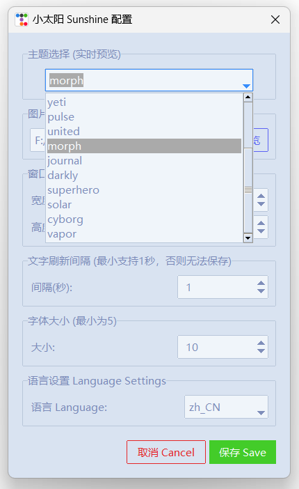
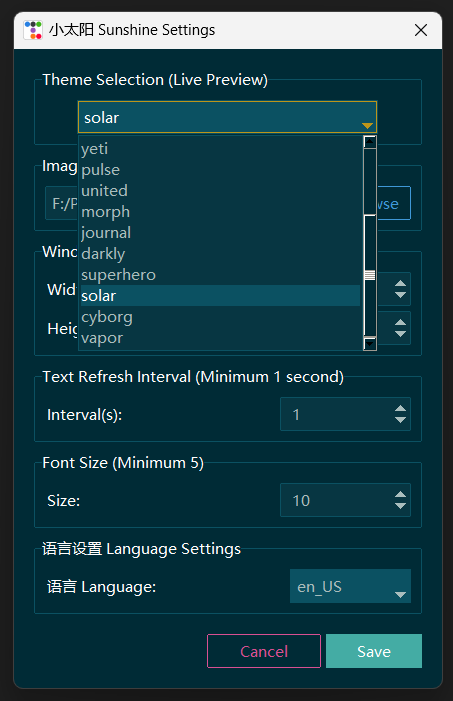

# Sunshine🌞小太阳 - Your Desktop Pinned Motto & Pic (Windows)

🌞**Sunshine 小太阳** 的灵感来源于作者阴雨天时心情不佳，希望用阳光为用户带来温暖。基于 Windows ， Sunshine 可以展示自定义的格言、图片，可以切换喜欢的主题，运行也非常简单。

Sunshine was inspired by the author's bad mood on rainy days, hoping to bring warmth to users. Based on Windows, Sunshine can display customized mottos and pics, switch favorite themes, and is easy to run.

## Features

- 📌**Inspirational Display**: 置顶展示多句提醒自己的格言，并配上一张图片。Presents multiple self - reminding mottos accompanied by an image, all **pinned** on the top of all windows.
- 🎨**Customizable Settings**: 可以切换主题、调整窗口大小、设置格言刷新频率等。Allows you to switch themes, adjust the window size, and set the refresh frequency of mottos. 
- ☁️**Lightweight Design**: 特别轻量级。Sunshine is extremely lightweight.

### Sunshine 双语效果图 Sunshine Screenshot （Both in Chinese and English）

### 双语配置效果图 Config Screenshot （Both in Chinese and English）

 

 

## 安装与运行 Install & Run 

1. 下载 Download：克隆仓库，或下载zip：`git clone git@github.com:JyiDeng/Sunshine.git`
2. 安装 Install：使用`requirements.txt`安装需要的库：`pip install -r requirements.txt`
3. 配置 Config：在`config.json`中，配置想要的格言。 In the `config.json` file, configure the mottos you desire. 
4. 运行 Run：`python Sunshine.py`，并在`设置/Settings`按钮中配置具体的图片、色彩、大小等。 Run the program by `python Sunshine.py`. After that, in the `设置/Settings` button, you can configure specific elements such as images, colors, and size.
5. 拖拽 Drag：按住图片部分进行拖拽。 Drag on the image part.

# 致谢 Acknowledgement

让我们说谢谢糯米（你可以在`pic/`中发现它的照片作为示例）：Let us thank Nuomi (You can find its photos in `pic/`):

